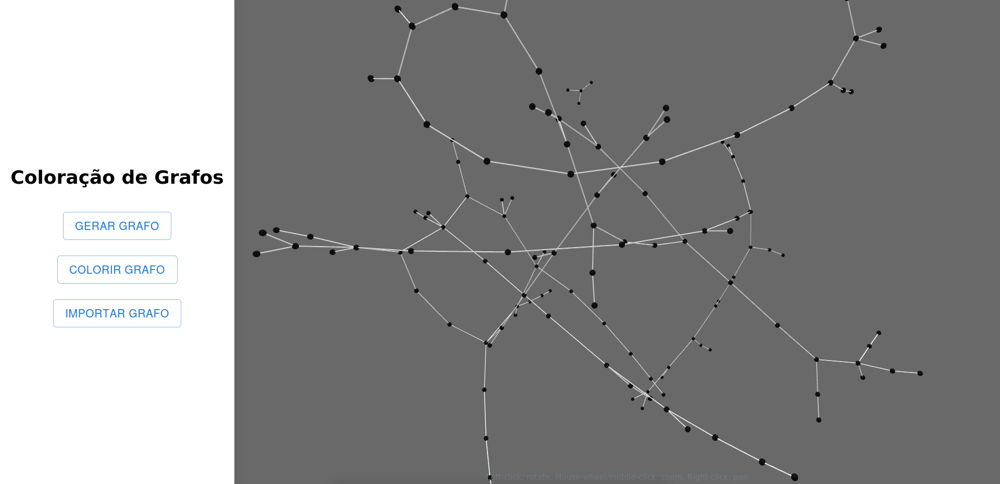
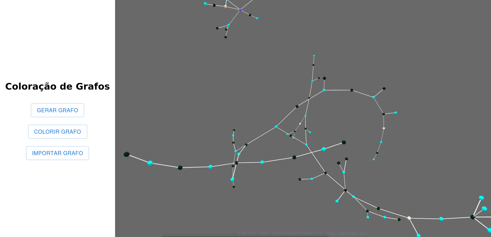
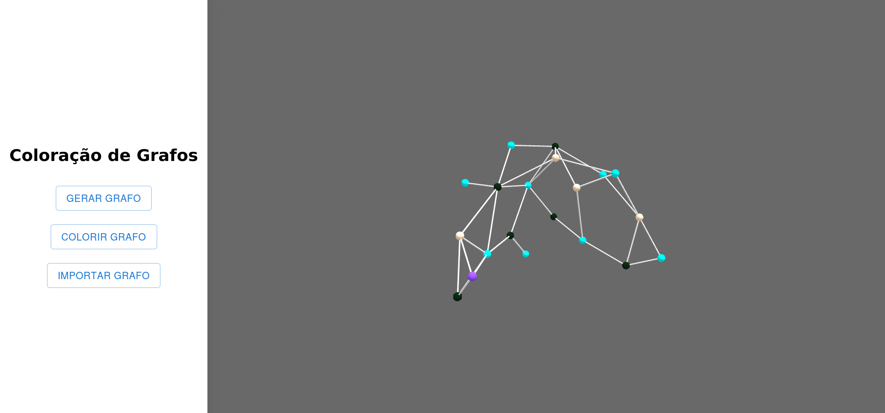

# Online Graph Coloring

**Número da Lista**: 32 
**Conteúdo da Disciplina**: Final 

## Alunos
|Matrícula | Aluno |
| -- | -- |
| 18/0149687 |  Daniel Porto de Souza |

## Sobre 
Se trata de uma plataforma que realiza o algorítimo de coloração de grafos utilizando uma rotina ambiciosa. Esse problema é muito famoso na computação e possui diversas aplicações. A plataforma possui a funcionalidade de gerar um grafo aleatório a fim de se visualizar a coloração, bem como outra funcionalidade para que se importe um grafo a partir de um documento de texto simples, cuja forma será explicada mais adiante.

## Screenshots

## Instalação 
**Linguagem**: JavaScript 
### Pré-requisitos:
- Git
- npm

## Uso 
Para a utilização, basta clonar o repositório com:
> $ git clone https://github.com/projeto-de-algoritmos/Final_OnlineGraphColoring.git

Feito a clone, dentro do diretório do repositório, basta executar os comandos:

> $ npm install

> $ npm start

Uma aba no seu navegador padrão deverá abrir. Casos não abra, basta acessar o localhost:3000

## Outros 

A funcionalidade de importação do grafo a partir de um arquivo utiliza arquivos de texto. Segunido a logica de uma lista de adjacências, cada nó deve estar em uma linha diferente e sua descrição deve seguir o seguinte padrão:

**id (1 a 4 digitos):id_vizinho1,id_vizinho2,...,id_vizinhoN**

### Exemplo:

**1:2,3,4** 
**2:3,4** 
**3:4** 
**4:2** 
**5:** 
**6:5** 
**7:6** 
**8:9** 
**9:5** 
**10:** 
**11:10,1,3,5,12** 
**12:6** 
**13:8,6,14** 
**14:17,20** 
**15:16** 
**16:1,5** 
**17:11,5,6** 
**18:19,20** 
**19:20,8** 
**20:7** 

Qualquer nó que fuja desse padrão será ignorado
